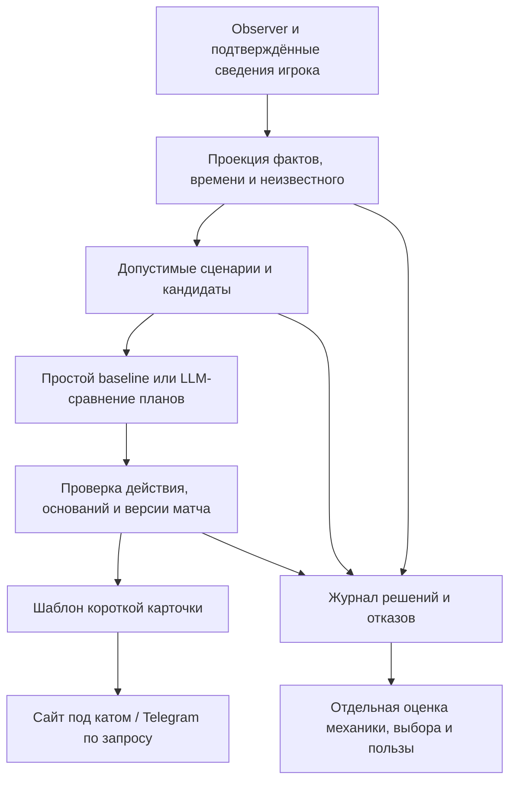

# Система полезных советов для нашего стака

6 октября 2026. Итог трёх исследовательских веток, перекрёстного red team всех 21 гипотезы и проверки текущего кода и production-данных. Это проект следующей системы: исследование выполнено, новая архитектура ещё не реализована, польза на живых игроках пока не доказана.

**Выбранный продукт: один полезный следующий шаг с объяснением, почему он сейчас предпочтительнее альтернативы.** Учитываем Turbo, героя, доступные факты и намерения человека. Карточки остаются под катом на сайте и доступны по запросу в Telegram. Цель — помочь принять решение и получить удовольствие от игры; количество сгенерированных советов не является успехом.

## Что выяснили на наших данных

| Проверка | Наблюдение | Что из этого следует |
| --- | --- | --- |
| Read-only production SQLite | 403 разобранных реплея, 501 API snapshot | Есть материал для случаев и проверки; это ещё не размеченный датасет решений |
| Последние 30 реплеев по match_id | Все Turbo; у всех есть версии парсера, боевого таймлайна и журнала смертей, время начала | Начинать с нашего Turbo, не переносить профессиональные ranked-билды как норму |
| Те же 30, только первый игрок каждого | Item timings и net worth по минутам есть в 30/30; item_uses непустое в 3/30 | Нельзя интерпретировать отсутствие item_uses как «забыл нажать предмет»; присутствие поля не доказывает полноту |
| Те же 30 | Явного patch нет в 30/30 | Историческую механику нельзя автоматически считать сегодняшней |
| Последние 100 сохранённых составов, только активный стак | 220 появлений игроков; Invoker 24, Sniper 16, Witch Doctor 9, Riki 8, Pudge 7 | Приоритет первых сценариев можно выбирать по реальной частоте; для hero × role × patch статистического ранжирования данных мало |
| 14 намеренно испорченных ответов через текущий validateAdvice | 11 приняты, 3 отклонены; один отдельный корректный контроль принят | Проверка ID/формата/имён не проверяет смысл. Это **не** оценка частоты ошибок генератора |

В пропущенных мутантах: командный strong dispel от Greaves, неверная механика Force Staff, необоснованные сведения об ульте, роли и привычках, обещание +17% побед, союзная «Мирана» как противник. Полный результат — [validator-mutations.json](research/advice-review/validator-mutations.json). Тесты не отправляли сообщения игрокам.

Отдельная важная поправка: `game.delay=120` — значение из SourceTV lobby. Мы не подтвердили, что оно равно задержке данных `GetRealtimeStats`. Формула «120 секунд + возраст снимка» пока не является измерением. Нужны раздельные время игры, время получения, возраст генерации и неизвестная фактическая задержка источника.

## Шесть решений, оставленных после red team

### 1. Отдельный, проверяемый контекст для советов игроку

Сырые данные наблюдателя не передаются напрямую в советчик. Сначала строится проекция разрешённых для этого сценария фактов: состав, наш игрок и его команда, подтверждённые предметы и наблюдения, режим, цель игрока. `ours` означает принадлежность стакy, `ally` — сторону в конкретном матче; это разные признаки. Возможная способность героя не означает изученную или готовую способность.

Каждый используемый факт имеет источник, время получения, статус неизвестности и семантику доступности. API без visibility-событий не позволяет доказать, что враг был виден игроку. Поэтому неподтверждённые spectator-only предметы, net worth и позиции врагов исключаются **до поиска и ранжирования кандидатов**, включая производные признаки и кеш. Одной фильтрации финального текста недостаточно: скрытая покупка может изменить рекомендуемый предмет без упоминания этой покупки.

Проверка: при изменении только исключённых полей рекомендация и основания должны оставаться прежними. При перестановке массивов сохраняется принадлежность команд. Неизвестное значение не превращается в ноль. Пока задержка не измерена, система не даёт приказов «прямо сейчас прыгай / иди туда».

### 2. Небольшая библиотека проверенных сценариев решения

Стартовый бюджет — примерно 8–12 сценариев, выбранных по реальным вопросам и матчам стака. Это ограничение объёма первой итерации, не доказанное достаточное покрытие. Полную энциклопедию взаимодействий Доты строить нецелесообразно.

Каждый сценарий хранит: цель; необходимые наблюдения; допустимые действия; эффект и его получателя; условия применения и исключения; противопоказания; цену альтернативы; источники, версию и статус проверки. Отдельно проверяются **истинность механики**, **применимость** и **предпочтительность покупки**. Верная механика сама по себе не делает покупку хорошей.

Пример структуры для Greaves: командное восстановление ресурсов и basic dispel владельца — разные эффекты с разными получателями. Из self-dispel нельзя выводить спасение союзника от контроля. Даже корректный self-dispel не доказывает возможность активации под рассматриваемым эффектом и не доказывает, что Greaves важнее следующего предмета на урон. Этот пример задаёт требования к рецепту; актуальное взаимодействие должно отдельно пройти проверку для поддерживаемой версии игры.

В наборе должны быть решения про урон, темп и фарм, а не только универсальную защиту. Иначе получим аккуратного, но бесполезного советчика, который всем предлагает переживать драки и никому — выигрывать их.

### 3. Выбирать действие и объяснять настоящую альтернативу

Варианты: закончить предмет, взять полезный компонент, продолжить план на урон/темп, сменить сборку, обоснованно сохранить золото, задать один существенный вопрос или отказаться от совета. Отказ и «пока не покупай» — разные ответы: второму требуется игровое основание. Если неизвестны курьер и stash, остаточная стоимость не выдаётся за точный текущий баланс.

Кандидаты объединяют план героя, проверенные ответы на подтверждённые угрозы и экономические варианты. Популярность OpenDota — способ не забыть распространённый предмет, а не итоговая оценка. Наличие компонентов учитывается, но не заставляет продолжать плохую сборку. Фиксированный top-32 по популярности и компонентам может отрезать лучший редкий вариант.

Роль и желание игрока можно указать добровольно и сохранить. «Хочу больше урона» — намерение, а не доказанный диагноз: проблема может быть в доступе к цели. При необходимости система показывает это разногласие через понятный tradeoff, а не автоматически соглашается.

LLM получает небольшой набор допустимых планов и выбирает между ними. Фактическая часть ответа собирается из проверенных утверждений и шаблонов; модель не добавляет механику из памяти. Начальная контрольная версия — простая памятка по герою/цели с проверенными исключениями. Если LLM не улучшает выбор или понятность относительно неё, она не нужна в этом участке.

### 4. Стабильный план, короткая карточка, минимум отвлечений

На игрока — следующий шаг, одна причина и условная альтернатива. Например, формат: «X → почему стоит отложить Y → какое условие изменит решение». Это структура, не универсальный совет купить конкретный предмет.

Новый текст появляется при существенном изменении оснований: покупке, смене цели, подтверждённой угрозе или утрате актуальности. Истечение двух минут само по себе не повод переизобретать сборку. У плана есть версия; ответ модели повторно сверяется с текущим матчем и предметами перед показом. Старая Telegram-карточка и новая карточка сайта должны быть различимы по времени и версии.

Командная помощь начинается с простого: показать уже имеющийся командный предмет или пересечение **подтверждённых намерений**. «Есть», «планирует», «согласовано» — разные состояния. Бот не назначает Pipe самому богатому, не считает паблик-союзника согласившимся и не запрещает любые дубли. Принятый людьми план сохраняется до явной смены.

### 5. Журнал решений и проверка пользы независимо от правдивости

Журнал сохраняет точный вход, исключённые классы данных, неизвестные поля, версии правил, кандидатов, причины отклонений, выбранное действие, исторический ответ и момент показа. Сохраняются также молчание и вопросы. Новый вызов случайной модели не обязан воспроизвести прежний текст; сохранённый исторический ответ обязан быть доступен для аудита.

Моменты проверки выбираются независимо от того, когда модель решила выдать карточку. Иначе система, отвечающая только в очевидных случаях, нарисует себе отличную точность. Реплей с полными будущими сведениями не заменяет тот вход, который был доступен советчику: исторические реконструкции помечаются отдельно, для точного сравнения нужны новые журналы наблюдателя.

Нужны два набора: атаки на механику/стороны/время/данные и естественные решения из разных матчей. Компетентный человек сначала видит только тогда доступный контекст и отмечает допустимые и явно плохие варианты; затем оценивает выбор без красивого объяснения; последним — само объяснение. Разногласия сохраняются. LLM red team помогает искать ошибки, но не заменяет такую человеческую оценку.

Учитываем отдельно: вредный выбор, ложный факт, приемлемый выбор, полезную новизну, пропущенную возможность помочь, повторы, вопросы и нагрузку на внимание. Открытие карточки, выполнение совета и реальная польза — разные события. Победа после совета не доказывает, что совет помог.

### 6. Ограниченная область работы и честное поведение при пробелах

Проверенная версия справочника не равна проверенной актуальности всех механик. Для правила хранятся источник и статус применимости к патчу; неизвестный патч не подменяется сегодняшней датой. Затронутые изменением правила отключаются или дают условный ответ до проверки. Неизвестность одной механики не обязана выключать все остальные советы всем игрокам.

Персонализацию начинаем с явно заданных предпочтений и проверяемых эпизодов после игры. Автоматическое «ты постоянно забываешь BKB» откладываем: нужны готовность предмета, возможность применения, контекст и знаменатель реальных возможностей, а не несколько выбранных смертей.

## Путь данных и границы ответственности

`advice-context.ts` отвечает за проекцию и кандидатов; `advice-sources.ts` — за происхождение и версии, но не за доказательство качества покупки. Новый модуль сценариев хранит условия и допустимые утверждения. `advice-model.ts` выбирает структурированное действие вместо свободного сочинения `reason`. `live-advice.ts` управляет версиями и повторной проверкой оснований. Общий renderer формирует согласованный текст для сайта и Telegram. Журнал и оценка вынесены из генератора, чтобы не позволять ему выбирать себе экзаменационные задачи.

## Порядок реализации и критерий продолжения

1. **Контракт входа и журнал.** Разделить команды и доступность данных, unknown и zero, время получения и неизвестную задержку. Записывать новые естественные моменты выбора. Закрыть смену матча, покупку во время генерации и устаревший ответ.
2. **Одна узкая группа сценариев и baseline.** Подготовить проверенные факты и шаблоны; закрыть найденные смысловые ошибки, включая все применимые мутации. Добавить новые случаи независимым автором. Оценить стоимость обновления правил при смене патча.
3. **Малый независимый диагностический набор.** Начать с 20–30 заранее отобранных решений из разных матчей. Проверить наличие приемлемого кандидата, качество выбора и пользу объяснения. Это рабочий бюджет первого исследования, не статистическая гарантия низкой ошибки. Если человеческой разметки нет, результаты называются автоматическим аудитом, а не экспертной оценкой.
4. **Сравнение LLM с простым советчиком.** Одинаковые входы, одинаковые допустимые действия, слепая оценка выбора отдельно от текста. Регулярно плохую группу решений сузить или исправить. Дорогой runtime-verifier добавлять только после отдельного доказательства выигрыша.
5. **Несколько добровольных игровых сессий.** Проверить, приходит ли совет вовремя, добавляет ли что-то игроку и стоит ли потраченного внимания. Собрать конкретные эпизоды изменившегося решения и причины игнорирования. Не выводить прирост win rate из малого пилота.

Критерий продолжения: в поддерживаемых сценариях нет нерешённых известных критических ошибок, а реальные игроки получают применимые, понятные и новые для них решения. Если всё формально верно, но очевидно или запаздывает, меняем содержание и момент показа. Расширять граф знаний или покупать более дорогую модель в ответ на это автоматически не следует.

## Что отсеяно

Полный граф всей Доты; обязательная вторая модель-проверяющий; автоматический командный оптимизатор; «лучший билд» по win rate предмета; нормы таймингов из маленьких Turbo cohorts; диагнозы привычек из отсутствующих событий; fine-tuning как первый шаг; обещания прироста побед. STRATZ оставлен только как отдельная короткая проверка конкретного недостающего поля. ProTracker не является зависимостью этой архитектуры.

## На чём основан выбор

В проверенной реализации OpenDota популярность предметов строится из ограниченной выборки разобранных матчей героя и фазовых счётчиков; она не отвечает на вопрос о лучшей покупке в нашем Turbo-контексте. Это основание использовать её для кандидатов. [Исходный код запросов OpenDota](https://github.com/odota/core/blob/e0847d8edcf33b7467860689b3277f91c1062103/svc/util/queries.ts).

Статический справочник полезен для ID, компонентов и исходных описаний, но фиксация commit не подтверждает полноту взаимодействий и текущую игровую применимость. [Проверенная ревизия dotaconstants](https://github.com/odota/dotaconstants/tree/b4b5a8299de5f3e0704e62fdd04a6a54c4d4548e).

RAGTruth показывает, что наличие извлечённых источников не устраняет неподтверждённые утверждения. Работа о RefChecker предлагает проверку отдельных утверждений. Это аргументы для разделения фактов и свободного текста, а не доказательство качества нашего Dota-советчика. [RAGTruth](https://aclanthology.org/2024.acl-long.585/), [Knowledge-Centric Hallucination Detection](https://aclanthology.org/2024.emnlp-main.395/).

Исследования selective prediction рассматривают ошибку вместе с долей обслуживаемых случаев. Для нас это мотивирует совместно измерять вред и полезное покрытие, но не позволяет переносить опубликованные пороги на Доту. [Selective Classification](https://arxiv.org/abs/1705.08500).

Корректная оценка альтернативных политик по историческим данным требует условий логирования и выбора действий. Обычная история покупок этих условий не обеспечивает; поэтому item win rate не превращается в причинный выигрыш рекомендации. [Unbiased Offline Evaluation of Contextual-bandit-based News Article Recommendation Algorithms](https://arxiv.org/abs/1003.5956).

Исследования интерфейсов AI подчёркивают необходимость понятных возможностей, ограничений и исправления системы. В нашей игре конкретная форма — короткий tradeoff, необязательное уточнение и контроль нагрузки; пользу именно такой формы ещё нужно проверить. [Guidelines for Human-AI Interaction](https://www.microsoft.com/en-us/research/publication/guidelines-for-human-ai-interaction/).

Полный след решений: [матрица red team всех 21 гипотезы](research/advice-review/README.md). Совпадение выводов трёх агентов не является тремя независимыми эмпирическими подтверждениями: у них общий код и пересекающиеся источники. Итоговые шесть решений — лучшие оставшиеся проектные гипотезы, а не сертификат качества.
